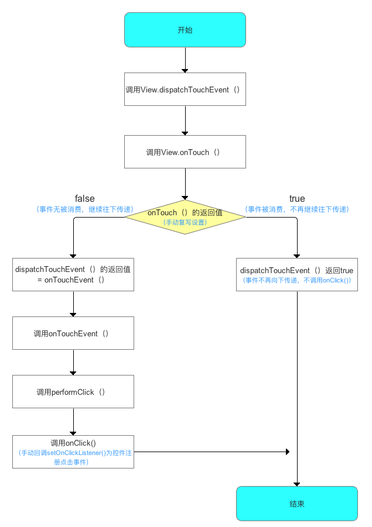

#### 事件传递过程

​			实际上，当我们手指触摸屏幕的时候，事件最先是传递给当前的`Actvity`，由`Actvity`的`dispatchTouchEvent`方法来分发事件，而`Actvity`会将事件传递给`Window`对象来分发，`Window`对象再传递给`DecorView`,`DecorView`则是我们在Actvity中通过`setContentView`后所设置的布局的父容器，通过`getWindow().getDecorView().findViewById(android.R.id.content).getChildAt(0`)这个方式就能获取到Activity所设置的布局。

Activity 的 `dispatchTouchEvent`方法

```java
public boolean dispatchTouchEvent(MotionEvent ev) {
    if (ev.getAction() == MotionEvent.ACTION_DOWN) {
        //空方法
        onUserInteraction();
    }
    //将事件传递给PhoneWindow处理
    if (getWindow().superDispatchTouchEvent(ev)) {
        return true;
    }
    return onTouchEvent(ev);
}
```

Window的`superDispatchTouchEvent`将事件分配给跟布局`mDecor`的`superDispatchTouchEvent`

```java
@Override
public boolean superDispatchTouchEvent(MotionEvent event) {
    //将事件传递给根View DecorView处理
    return mDecor.superDispatchTouchEvent(event);
}
```

最终将事件传递给 `FrameLayout` 的`dispatchTouchEvent`

```java
public boolean superDispatchTouchEvent(MotionEvent event) {
	//调用DecorView的父类 也就是FrameLayout的dispatchTouchEvent
    return super.dispatchTouchEvent(event);
}
```

调用FrameLayout 的父类ViewGroup 的dispatchTouchEvent

<h3>ViewGroup的事件分发</h3>

```java
@Override
public boolean dispatchTouchEvent(MotionEvent ev) {
   .......
       
        final boolean intercepted;
        if (actionMasked == MotionEvent.ACTION_DOWN
                || mFirstTouchTarget != null) {
            //是否允许事件被拦截
            final boolean disallowIntercept = (mGroupFlags & FLAG_DISALLOW_INTERCEPT) != 0;			
            //如果不容许拦截
            if (!disallowIntercept) {
                //事件是否被拦截
                intercepted = onInterceptTouchEvent(ev);
                ev.setAction(action); // restore action in case it was changed
            } else {
                intercepted = false;
            }
        } else {
            // There are no touch targets and this action is not an initial down
            // so this view group continues to intercept touches.
            intercepted = true;
        }

        // If intercepted, start normal event dispatch. Also if there is already
        // a view that is handling the gesture, do normal event dispatch.
        if (intercepted || mFirstTouchTarget != null) {
            ev.setTargetAccessibilityFocus(false);
        }

        // Check for cancelation.
        final boolean canceled = resetCancelNextUpFlag(this)
                || actionMasked == MotionEvent.ACTION_CANCEL;

        // Update list of touch targets for pointer down, if needed.
        final boolean split = (mGroupFlags & FLAG_SPLIT_MOTION_EVENTS) != 0;
        TouchTarget newTouchTarget = null;
        boolean alreadyDispatchedToNewTouchTarget = false;
    	//事件未被拦截时
        if (!canceled && !intercepted) {

            // If the event is targeting accessibility focus we give it to the
            // view that has accessibility focus and if it does not handle it
            // we clear the flag and dispatch the event to all children as usual.
            // We are looking up the accessibility focused host to avoid keeping
            // state since these events are very rare.
            View childWithAccessibilityFocus = ev.isTargetAccessibilityFocus()
                    ? findChildWithAccessibilityFocus() : null;

            if (actionMasked == MotionEvent.ACTION_DOWN
                    || (split && actionMasked == MotionEvent.ACTION_POINTER_DOWN)
                    || actionMasked == MotionEvent.ACTION_HOVER_MOVE) {
                final int actionIndex = ev.getActionIndex(); // always 0 for down
                final int idBitsToAssign = split ? 1 << ev.getPointerId(actionIndex)
                        : TouchTarget.ALL_POINTER_IDS;

                // Clean up earlier touch targets for this pointer id in case they
                // have become out of sync.
                removePointersFromTouchTargets(idBitsToAssign);
				//里面做了一个 For 循环，通过倒序遍历 ViewGroup 下面的所有子 View，然后一个一个判断
                //点击位置是否是该子 View 的布局区域，当然还有一些其他的，
                //由于篇幅原因，这里就不细讲  了。
                final int childrenCount = mChildrenCount;
                if (newTouchTarget == null && childrenCount != 0) {
                    final float x = ev.getX(actionIndex);
                    final float y = ev.getY(actionIndex);
                    // Find a child that can receive the event.
                    // Scan children from front to back.
                    final ArrayList<View> preorderedList = buildTouchDispatchChildList();
                    final boolean customOrder = preorderedList == null
                            && isChildrenDrawingOrderEnabled();
                    final View[] children = mChildren;
                    for (int i = childrenCount - 1; i >= 0; i--) {
                        final int childIndex = getAndVerifyPreorderedIndex(
                                childrenCount, i, customOrder);
                        final View child = getAndVerifyPreorderedView(
                                preorderedList, children, childIndex);

                        // If there is a view that has accessibility focus we want it
                        // to get the event first and if not handled we will perform a
                        // normal dispatch. We may do a double iteration but this is
                        // safer given the timeframe.
                        if (childWithAccessibilityFocus != null) {
                            if (childWithAccessibilityFocus != child) {
                                continue;
                            }
                            childWithAccessibilityFocus = null;
                            i = childrenCount - 1;
                        }

                        if (!canViewReceivePointerEvents(child)
                                || !isTransformedTouchPointInView(x, y, child, null)) {
                            ev.setTargetAccessibilityFocus(false);
                            continue;
                        }

                        newTouchTarget = getTouchTarget(child);
                        if (newTouchTarget != null) {
                            // Child is already receiving touch within its bounds.
                            // Give it the new pointer in addition to the ones it is handling.
                            newTouchTarget.pointerIdBits |= idBitsToAssign;
                            break;
                        }

                        resetCancelNextUpFlag(child);
                        if (dispatchTransformedTouchEvent(ev, false, child, idBitsToAssign)) {
                            // Child wants to receive touch within its bounds.
                            mLastTouchDownTime = ev.getDownTime();
                            if (preorderedList != null) {
                                // childIndex points into presorted list, find original index
                                for (int j = 0; j < childrenCount; j++) {
                                    if (children[childIndex] == mChildren[j]) {
                                        mLastTouchDownIndex = j;
                                        break;
                                    }
                                }
                            } else {
                                mLastTouchDownIndex = childIndex;
                            }
                            mLastTouchDownX = ev.getX();
                            mLastTouchDownY = ev.getY();
                            newTouchTarget = addTouchTarget(child, idBitsToAssign);
                            alreadyDispatchedToNewTouchTarget = true;
                            break;
                        }

                        // The accessibility focus didn't handle the event, so clear
                        // the flag and do a normal dispatch to all children.
                        ev.setTargetAccessibilityFocus(false);
                    }
                    if (preorderedList != null) preorderedList.clear();
                }

                if (newTouchTarget == null && mFirstTouchTarget != null) {
                    // Did not find a child to receive the event.
                    // Assign the pointer to the least recently added target.
                    newTouchTarget = mFirstTouchTarget;
                    while (newTouchTarget.next != null) {
                        newTouchTarget = newTouchTarget.next;
                    }
                    newTouchTarget.pointerIdBits |= idBitsToAssign;
                }
            }
        }
		//事件被拦截时  mFirstTouchTarget为空 
        // Dispatch to touch targets.
        if (mFirstTouchTarget == null) {
            // No touch targets so treat this as an ordinary view.
            handled = dispatchTransformedTouchEvent(ev, canceled, null,
                    TouchTarget.ALL_POINTER_IDS);
        } else {
            // Dispatch to touch targets, excluding the new touch target if we already
            // dispatched to it.  Cancel touch targets if necessary.
            TouchTarget predecessor = null;
            TouchTarget target = mFirstTouchTarget;
            while (target != null) {
                final TouchTarget next = target.next;
                if (alreadyDispatchedToNewTouchTarget && target == newTouchTarget) {
                    handled = true;
                } else {
                    final boolean cancelChild = resetCancelNextUpFlag(target.child)
                            || intercepted;
                    if (dispatchTransformedTouchEvent(ev, cancelChild,
                            target.child, target.pointerIdBits)) {
                        handled = true;
                    }
                    if (cancelChild) {
                        if (predecessor == null) {
                            mFirstTouchTarget = next;
                        } else {
                            predecessor.next = next;
                        }
                        target.recycle();
                        target = next;
                        continue;
                    }
                }
                predecessor = target;
                target = next;
            }
        }

        // Update list of touch targets for pointer up or cancel, if needed.
        if (canceled
                || actionMasked == MotionEvent.ACTION_UP
                || actionMasked == MotionEvent.ACTION_HOVER_MOVE) {
            resetTouchState();
        } else if (split && actionMasked == MotionEvent.ACTION_POINTER_UP) {
            final int actionIndex = ev.getActionIndex();
            final int idBitsToRemove = 1 << ev.getPointerId(actionIndex);
            removePointersFromTouchTargets(idBitsToRemove);
        }
    }

    if (!handled && mInputEventConsistencyVerifier != null) {
        mInputEventConsistencyVerifier.onUnhandledEvent(ev, 1);
    }
    return handled;
}
```

当ViewGroup 拦截了事件   `onInterceptTouchEvent`返回为`true`  `mFirstTouchTarget`为空

会进入下面的判断

```java
if (mFirstTouchTarget == null) {
    // No touch targets so treat this as an ordinary view.
    handled = dispatchTransformedTouchEvent(ev, canceled, null,
            TouchTarget.ALL_POINTER_IDS);
}
```

```java
private boolean dispatchTransformedTouchEvent(MotionEvent event, boolean cancel,
        View child, int desiredPointerIdBits) {
.......

    // Perform any necessary transformations and dispatch.
    if (child == null) {
        handled = super.dispatchTouchEvent(transformedEvent);
    } else {
        final float offsetX = mScrollX - child.mLeft;
        final float offsetY = mScrollY - child.mTop;
        transformedEvent.offsetLocation(offsetX, offsetY);
        if (! child.hasIdentityMatrix()) {
            transformedEvent.transform(child.getInverseMatrix());
        }

        handled = child.dispatchTouchEvent(transformedEvent);
    }

    // Done.
    transformedEvent.recycle();
    return handled;
}
```

由于传入的child 为null  , 最终会调用ViewGroup的父类View 的 `dispatchTouchEvent`

当ViewGroup 未拦截时 及 `onInterceptTouchEvent`返回值未`false` ，事件会传递给ViewGroup对应的子View 进行处理

最终事件都会经过View 的`dispatchTouchEvent`进行处理

<h3>View的事件分发</h3>

```java
public boolean dispatchTouchEvent(MotionEvent event) {
    // If the event should be handled by accessibility focus first.
    if (event.isTargetAccessibilityFocus()) {
        // We don't have focus or no virtual descendant has it, do not handle the event.
        if (!isAccessibilityFocusedViewOrHost()) {
            return false;
        }
        // We have focus and got the event, then use normal event dispatch.
        event.setTargetAccessibilityFocus(false);
    }

    boolean result = false;

    if (mInputEventConsistencyVerifier != null) {
        mInputEventConsistencyVerifier.onTouchEvent(event, 0);
    }

    final int actionMasked = event.getActionMasked();
    if (actionMasked == MotionEvent.ACTION_DOWN) {
        // Defensive cleanup for new gesture
        stopNestedScroll();
    }

    if (onFilterTouchEventForSecurity(event)) {
        if ((mViewFlags & ENABLED_MASK) == ENABLED && handleScrollBarDragging(event)) {
            result = true;
        }
        //noinspection SimplifiableIfStatement
        ListenerInfo li = mListenerInfo;
        if (li != null && li.mOnTouchListener != null
                && (mViewFlags & ENABLED_MASK) == ENABLED
                && li.mOnTouchListener.onTouch(this, event)) {
            result = true;
        }

        if (!result && onTouchEvent(event)) {
            result = true;
        }
    }

    if (!result && mInputEventConsistencyVerifier != null) {
        mInputEventConsistencyVerifier.onUnhandledEvent(event, 0);
    }

    // Clean up after nested scrolls if this is the end of a gesture;
    // also cancel it if we tried an ACTION_DOWN but we didn't want the rest
    // of the gesture.
    if (actionMasked == MotionEvent.ACTION_UP ||
            actionMasked == MotionEvent.ACTION_CANCEL ||
            (actionMasked == MotionEvent.ACTION_DOWN && !result)) {
        stopNestedScroll();
    }

    return result;
}
```

由以上代码可以看出 *onTouch() 方法优先级高于 onTouchEvent(event) 方法*

```java
public boolean onTouchEvent(MotionEvent event) {
    final float x = event.getX();
    final float y = event.getY();
    final int viewFlags = mViewFlags;
    final int action = event.getAction();

    final boolean clickable = ((viewFlags & CLICKABLE) == CLICKABLE
            || (viewFlags & LONG_CLICKABLE) == LONG_CLICKABLE)
            || (viewFlags & CONTEXT_CLICKABLE) == CONTEXT_CLICKABLE;

    if ((viewFlags & ENABLED_MASK) == DISABLED) {
        if (action == MotionEvent.ACTION_UP && (mPrivateFlags & PFLAG_PRESSED) != 0) {
            setPressed(false);
        }
        mPrivateFlags3 &= ~PFLAG3_FINGER_DOWN;
        // A disabled view that is clickable still consumes the touch
        // events, it just doesn't respond to them.
        return clickable;
    }
    if (mTouchDelegate != null) {
        if (mTouchDelegate.onTouchEvent(event)) {
            return true;
        }
    }

    if (clickable || (viewFlags & TOOLTIP) == TOOLTIP) {
        switch (action) {
            case MotionEvent.ACTION_UP:
                mPrivateFlags3 &= ~PFLAG3_FINGER_DOWN;
                if ((viewFlags & TOOLTIP) == TOOLTIP) {
                    handleTooltipUp();
                }
                if (!clickable) {
                    removeTapCallback();
                    removeLongPressCallback();
                    mInContextButtonPress = false;
                    mHasPerformedLongPress = false;
                    mIgnoreNextUpEvent = false;
                    break;
                }
                boolean prepressed = (mPrivateFlags & PFLAG_PREPRESSED) != 0;
                if ((mPrivateFlags & PFLAG_PRESSED) != 0 || prepressed) {
                    // take focus if we don't have it already and we should in
                    // touch mode.
                    boolean focusTaken = false;
                    if (isFocusable() && isFocusableInTouchMode() && !isFocused()) {
                        focusTaken = requestFocus();
                    }

                    if (prepressed) {
                        // The button is being released before we actually
                        // showed it as pressed.  Make it show the pressed
                        // state now (before scheduling the click) to ensure
                        // the user sees it.
                        setPressed(true, x, y);
                    }

                    if (!mHasPerformedLongPress && !mIgnoreNextUpEvent) {
                        // This is a tap, so remove the longpress check
                        removeLongPressCallback();

                        // Only perform take click actions if we were in the pressed state
                        if (!focusTaken) {
                            // Use a Runnable and post this rather than calling
                            // performClick directly. This lets other visual state
                            // of the view update before click actions start.
                            if (mPerformClick == null) {
                                mPerformClick = new PerformClick();
                            }
                            if (!post(mPerformClick)) {
                                performClickInternal();
                            }
                        }
                    }

                    if (mUnsetPressedState == null) {
                        mUnsetPressedState = new UnsetPressedState();
                    }

                    if (prepressed) {
                        postDelayed(mUnsetPressedState,
                                ViewConfiguration.getPressedStateDuration());
                    } else if (!post(mUnsetPressedState)) {
                        // If the post failed, unpress right now
                        mUnsetPressedState.run();
                    }

                    removeTapCallback();
                }
                mIgnoreNextUpEvent = false;
                break;

            case MotionEvent.ACTION_DOWN:
                if (event.getSource() == InputDevice.SOURCE_TOUCHSCREEN) {
                    mPrivateFlags3 |= PFLAG3_FINGER_DOWN;
                }
                mHasPerformedLongPress = false;

                if (!clickable) {
                    checkForLongClick(0, x, y);
                    break;
                }

                if (performButtonActionOnTouchDown(event)) {
                    break;
                }

                // Walk up the hierarchy to determine if we're inside a scrolling container.
                boolean isInScrollingContainer = isInScrollingContainer();

                // For views inside a scrolling container, delay the pressed feedback for
                // a short period in case this is a scroll.
                if (isInScrollingContainer) {
                    mPrivateFlags |= PFLAG_PREPRESSED;
                    if (mPendingCheckForTap == null) {
                        mPendingCheckForTap = new CheckForTap();
                    }
                    mPendingCheckForTap.x = event.getX();
                    mPendingCheckForTap.y = event.getY();
                    postDelayed(mPendingCheckForTap, ViewConfiguration.getTapTimeout());
                } else {
                    // Not inside a scrolling container, so show the feedback right away
                    setPressed(true, x, y);
                    checkForLongClick(0, x, y);
                }
                break;

            case MotionEvent.ACTION_CANCEL:
                if (clickable) {
                    setPressed(false);
                }
                removeTapCallback();
                removeLongPressCallback();
                mInContextButtonPress = false;
                mHasPerformedLongPress = false;
                mIgnoreNextUpEvent = false;
                mPrivateFlags3 &= ~PFLAG3_FINGER_DOWN;
                break;

            case MotionEvent.ACTION_MOVE:
                if (clickable) {
                    drawableHotspotChanged(x, y);
                }

                // Be lenient about moving outside of buttons
                if (!pointInView(x, y, mTouchSlop)) {
                    // Outside button
                    // Remove any future long press/tap checks
                    removeTapCallback();
                    removeLongPressCallback();
                    if ((mPrivateFlags & PFLAG_PRESSED) != 0) {
                        setPressed(false);
                    }
                    mPrivateFlags3 &= ~PFLAG3_FINGER_DOWN;
                }
                break;
        }

        return true;
    }

    return false;
}
```

<h3>总结</h3>

#### Activity 的事件分发示意图


#### ViewGroup 事件分发示意图


#### View 的事件分发示意图



#### 事件分发工作流程总结

